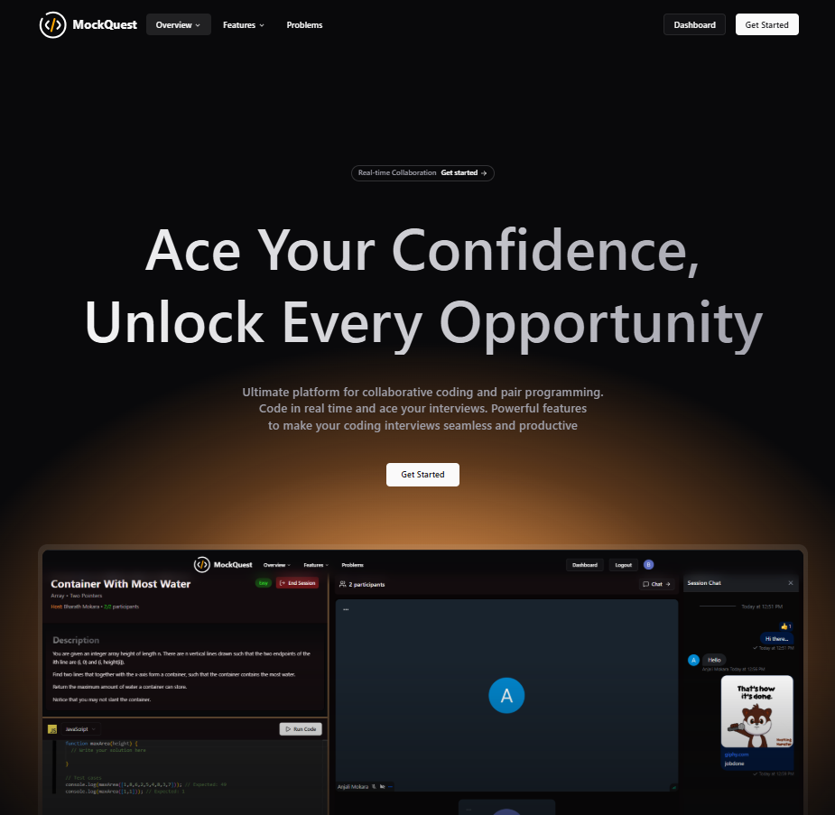

# MockQuest 🎯

**Ace Your Confidence, Unlock Every Opportunity**

MockQuest is a full-stack interview preparation platform built with **React** (frontend) and **.NET Core** (backend). It integrates advanced services like **Clerk** for authentication, **Stream** for real-time video and chat, and **MongoDB** for application data storage. Designed for seamless **1-to-1 mock interview sessions**, MockQuest provides a collaborative coding environment with video calling, screen sharing, and chat — all powered by curated problems and multi-language support.

---

## 📸 MockQuest

---

## ⚙️ Tech Stack
- **Frontend:** React, TypeScript, Vite  
- **Backend:** .NET Core API  
- **Authentication:** Clerk  
- **Video & Chat:** Stream  
- **Database:** MongoDB  
- **Upcoming Enhacements:** AI-powered interview assistance  

---

## 🔍 SetUp
Clone the repo
git clone https://github.com/your-username/mockquest.git

**Frontend setup**
- cd frontend
- npm install
- npm run dev

**Backend setup**
- cd backend
- dotnet restore
- dotnet run

---

